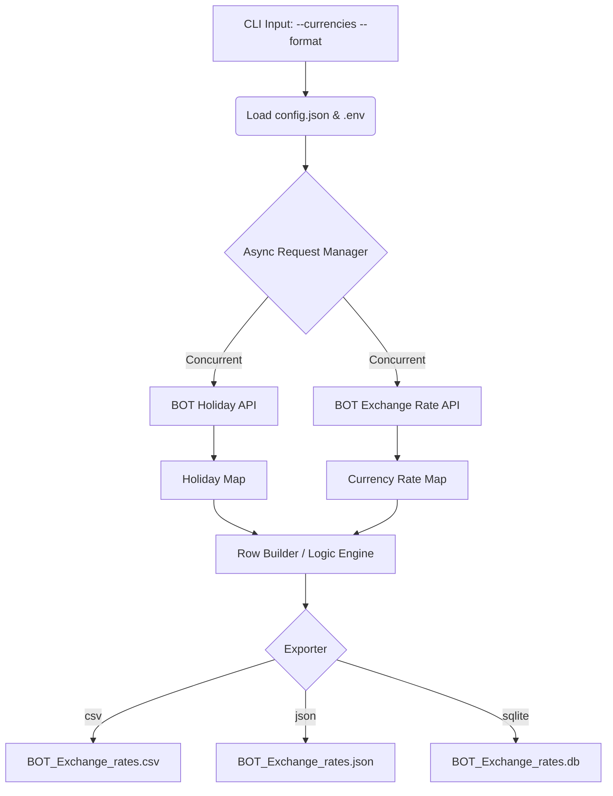
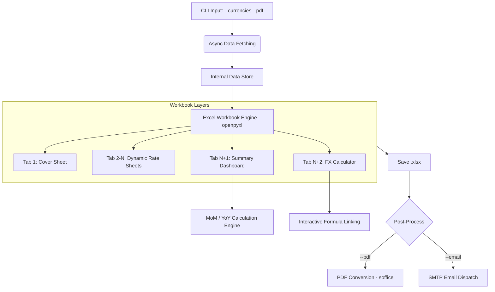

# Bank of Thailand Exchange Rate Generator

A Python toolset designed for corporate finance departments to automatically fetch, process, and format official exchange rates (USD and EUR) from the Bank of Thailand (BOT) API.

## Features

- **Authoritative Data Integration:** Synchronizes directly with the official Bank of Thailand (BOT) API to ensure precise, authoritative Weighted-Average Interbank Exchange Rates.
- **Corporate Formatting:** Generates a presentation-ready Excel workbook with multiple tabs, conditional formatting, and performance line charts.
- **Precision Financial Compliance:** Supports high-precision calculations (4+ decimal places) and incorporates a comprehensive Thai fiscal holiday calendar to ensure accurate reporting for weekend-adjusted bank settlements.
- **Ultra-Fast & Stable Performance:** Re-engineered with an **asynchronous fetching engine** (`asyncio` + `aiohttp`) and **concurrency throttling** (`asyncio.Semaphore`). This ensures massive data downloads complete in seconds while remaining 100% stable on older office PCs and legacy network hardware by preventing connection overloads.
- **Command-Line Flexibility:** Easily specify report start and end dates via CLI flags.

### 📊 `bot_generator.py` (Data Engine)
**Purpose**: An asynchronous data fetcher designed for high-speed retrieval of historical rates and holidays.
*   **Async Engine**: Uses `aiohttp` and `asyncio` to fetch years of holiday data and 30-day rate chunks concurrently.
*   **Multi-Format Export**: Dynamically writes results to **CSV**, **JSON**, or **SQLite** based on user CLI arguments.
*   **Smart Rate Mapping**: Maps "Buying Transfer TT" and "Selling" rates to specific ISO date keys, handling weekend gaps with "Weekend" remarks.



### 📈 `bot_excel_report.py` (Executive Reporter)
**Purpose**: Generates a premium, analysis-ready Excel dashboard and PDF for financial stakeholders.
*   **Dynamic Tab Generation**: Automatically creates a "Daily Rates" sheet for every currency requested (USD, EUR, JPY, etc.).
*   **Executive Summary Dashboard**: Calculates MoM and YoY percentage changes with conditional formatting for trend visualization.
*   **Monthly Analysis**: Aggregates daily data into monthly averages and volatility checks.
*   **Interactive FX Calculator**: Inter-linked converter using Excel formulas with dynamic rate lookups.



## Prerequisites

- **Python 3.7+**  &nbsp; [](https://www.python.org/downloads/)
- **Bank of Thailand API Tokens**

> [!NOTE]
> **Need Python?**
>
> - **Windows:** [Download](https://www.python.org/downloads/windows/) the latest installer and **IMPORTANT**: Check the box **"Add Python to PATH"** during installation.
> - **macOS:** [Download](https://www.python.org/downloads/macos/) and run the installer, or use `brew install python` if you have Homebrew.
> - **Verify:** Open your terminal and type `python3 --version` to check.

## Setup

1. **Install Dependencies:**
   The `bot_excel_report.py` script requires `openpyxl`. It will attempt to install it automatically into a local `_libs` folder if it cannot find it, preventing system package conflicts.

2. **Configure API Tokens:**
   This project requires two API tokens from the Bank of Thailand.

   - Edit the `.env` file in the root directory.
   - Add or update your tokens in the following format:

     ```env
     BOT_TOKEN_EXG="your_exchange_rate_token_here"
     BOT_TOKEN_HOL="your_holiday_token_here"
     ```

   > [!TIP]
   > **Detailed Guide: How to get your Bank of Thailand API Tokens**
   > 1. **Register:** Sign up at the [BOT Developer Portal](https://portal.api.bot.or.th/).
   > 2. **Subscribe to Exchange Rates:** Go to **Catalogues**, find the **Exchange Rates** card and click **MORE INFO**. Scroll to the bottom and click **ACCESS WITH THIS PLAN**.
   > 3. **Subscribe to Holidays:** Go back to **Catalogues**, find the **Others** card and click **MORE INFO**. Scroll to the bottom and click **ACCESS WITH THIS PLAN**.
   > 4. **Register your App:** Click your **Cart icon** (top right) and choose **Create a new app** to link these subscriptions to a project name of your choice.
   > 5. **Copy your Token:** Go to **Profile** > **My apps**, select the app you just created, and you will find the **Token** ready to copy.

## Usage

**To generate an Executive Excel Report:**

```bash
# Default (Start 2025-01-01 to today)
python3 bot_excel_report.py

# Custom Period
python3 bot_excel_report.py --start 2024-01-01 --end 2024-12-31
```

*Outputs: `BOT_ExchangeRate_Report.xlsx`*

**To generate a raw CSV:**

```bash
# Default (Start 2025-01-01 to today)
python3 bot_generator.py

# Custom Period
python3 bot_generator.py --start 2024-01-01
```

*Outputs: `BOT_Exchange_rates.csv`*

---

### Command Line Arguments

Both scripts support the following parameters:

| Argument | Format | Description | Default |
| :--- | :--- | :--- | :--- |
| `--start` | `YYYY-MM-DD` | The start date for the data fetch | `2025-01-01` |
| `--end` | `YYYY-MM-DD` | The end date for the data fetch | `Today` |


---

### File Structure

| File | Description |
| :--- | :--- |
| `bot_excel_report.py` | Executive Excel Report generator with charts and formatting |
| `bot_generator.py` | Raw CSV generator |
| `config.json` | Centralized API, currency, and holiday configuration |
| `.env` | API token configuration |

